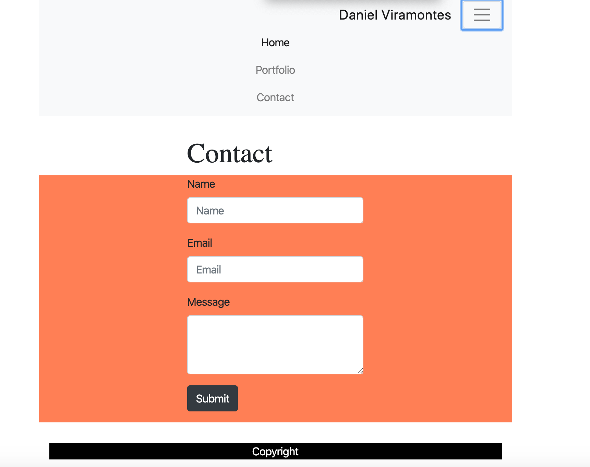
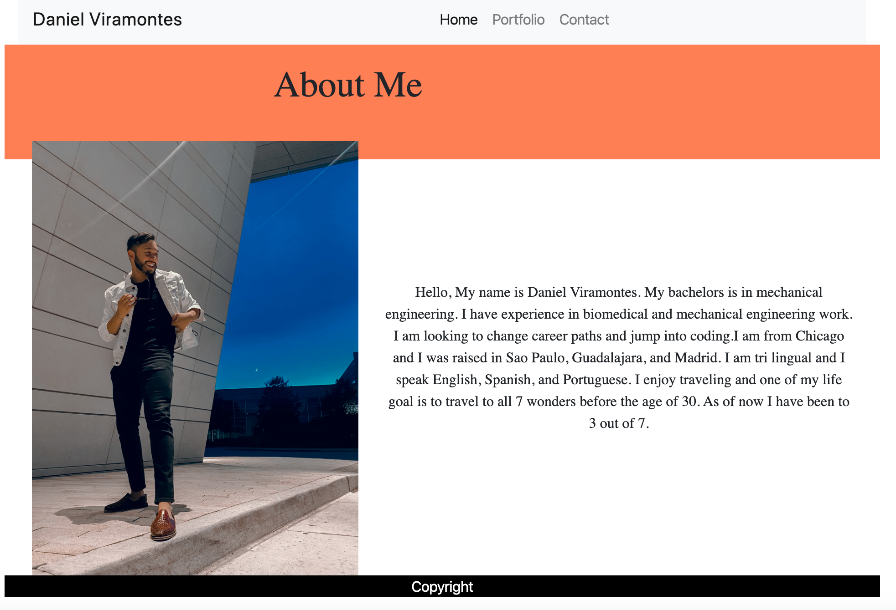
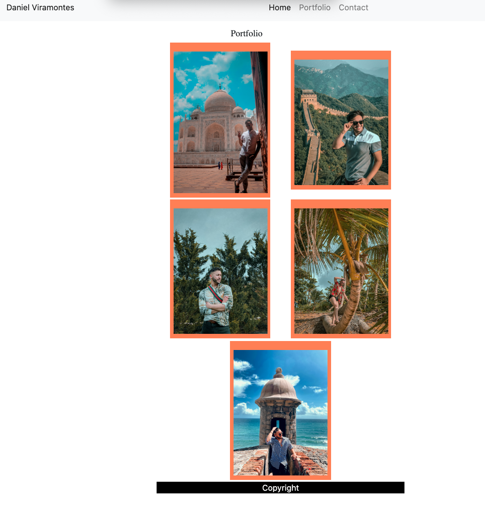

# Responsiveness-Portfolio
The assigment was to create our own portfolio that is responsive. 

# Accesssing 
To access the porfolio[Portfolio](https://danielviram.github.io/Responsiveness-Portfolio/)
To acess the Repo [Repo](https://github.com/danielviram/Responsiveness-Portfolio)

# Assigment
 To create a mobile responsive portfolio using Bootstrap.

 # Process
* Files: `index.html`, `portfolio.html` and `contact.html` where created.
* After that, Bootstrap was used to develop the portfolio site using 
 a navbar, a responsive layout, and responsive images. 

# Results 

